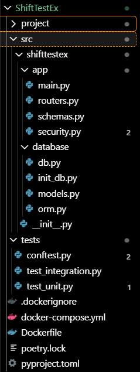

<p>
  
</p>

# Сервис бронирования переговорных комнат

## Описание проблемы и постановка задачи

Коворкинг столкнулся с хаосом в бронировании переговорных: сотрудники путают слоты, возникают наложения встреч, а администраторы тратят часы на ручное согласование.

Клиенты жалуются на неудобство и отсутствие прозрачности графика занятости.

Ваша задача — создать веб-сервис для автоматизации бронирования переговорных комнат в коворкинге.

В системе есть несколько комнат, каждая из которых имеет заранее заданные временные слоты (например, «09:00–11:00», «13:00–16:00» и т.п.).

Помимо комнат в системе есть сотрудники и администраторы.

Сотрудники могут:

- просматривать доступность всех комнат на конкретную дату;
- создавать свои бронирования;
- отменять свои бронирования;
- не имеют доступа к чужим бронированиям.

Администраторы, дополнительно к возможностям сотрудников, могут отменять любые бронирования.

## Обязательные требования к решению

### Технические требования

- Язык: **Python 3.11+**.
- Веб-фреймворк: **FastAPI**.
- Зависимости зафиксированы с помощью **Poetry** (в проекте присутствуют `pyproject.toml` и `poetry.lock`).
- Написаны юнит-тесты с использованием фреймворка **pytest**.
- Сервис контейнеризирован с помощью **Docker** (в проекте присутствует `Dockerfile`).
- Приложение должно запускаться командой `docker run ...`.
- Код размещен в публичном Git-репозитории.
- В репозитории создан `README.md`, содержащий инструкцию по запуску приложения и примеры его работы.

### Функциональные требования

- В сервисе реализованы все необходимые HTTP-методы для решения поставленной задачи (описание задачи см. выше).
- Сервис реализован с соблюдением REST-принципов.
- Аутентификация пользователей осуществляется через JWT-токен, имеющий ограниченный срок действия.
- Получение токена осуществляется по логину и паролю.

## Дополнительные требования

Необязательные требования, дающие преимущество при оценке работы:

- Реализованы интеграционные тесты.
- Данные приложения (комнаты, бронирования, пользователи и т.д.) хранятся не внутри сервиса (или в отдельном файле), а в **PostgreSQL**, взаимодействие с которой осуществляется через **SQLAlchemy** (или **SQLModel**).
- Написан `docker-compose.yml` для запуска всего сервиса вместе с базой данных.

## Процедура оценки

Процедура оценки состоит из двух этапов.

### Первый этап

Первый этап включает в себя:

- Проверку соответствия всем пунктам, указанным в блоке **«Технические требования»**.
- Проверку корректности запуска и старта приложения как локально (через `uvicorn` или `poetry run`), так и в Docker.

> При невыполнении любого из пунктов выше дальнейшая проверка не осуществляется.

### Второй этап

Второй этап включает в себя:

- Проверку наличия и работоспособности всего необходимого функционала, заявленного в задаче.
- Проверку изоляции данных разных пользователей и корректности работы прав.
- Оценку чистоты кода и его разделение на слои.
- Оценку качества и объема тестового покрытия.
- Оценку качества и подробности документации.

## Удачи!

**Команда ШИФТ**

##

# Инструкция по запуску

Запустить в корне проекта командой:

```bash
docker compose up -d
```

##

# Структура проекта:

<p>
  
</p>

## 

### Основные поля в БД для проверки создаются автоматически при запуске контейнера. Документация: http://localhost:8000/docs . Может быть кому то это решение проигодиться при поступлении на курс или подготовке к собеседованию. Кто то даже сможет дать фидбэк этой кодовой базе и исправит ошибки, т. к. в разработке мне помогал ИИ.
